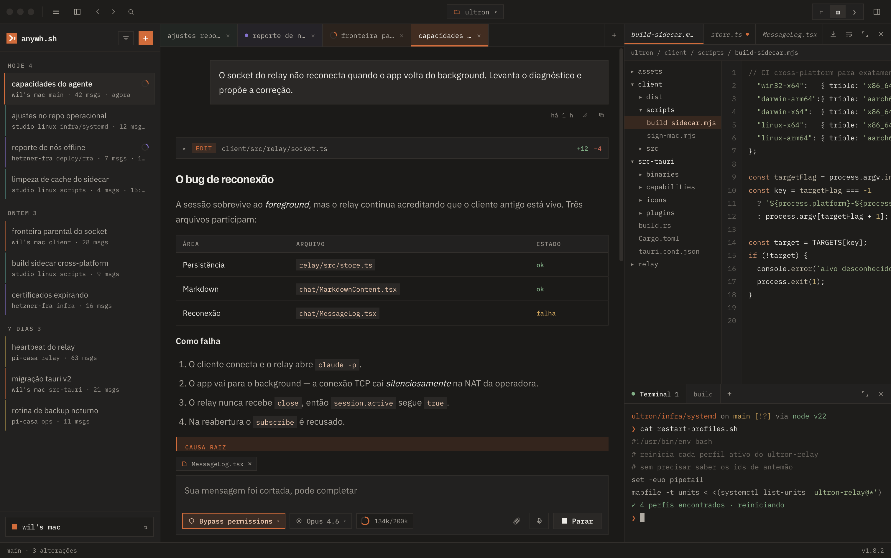

<div align="center">


# anywh.sh

### A self-hosted remote control for your coding agents — chat, voice, and a file browser from any device, while they keep running on your own machine

**Agent-agnostic by design** — Claude Code, Codex CLI, and more

[](https://github.com/anywh-sh/anywh/actions/workflows/pr.yml)
[](https://github.com/anywh-sh/anywh/releases/latest)
[](https://github.com/anywh-sh/anywh/releases)
[](LICENSE)

[Website](https://anywh.sh) • [Getting started](#quick-start) • [Issues](https://github.com/anywh-sh/anywh/issues)

</div>

---

<p align="center">
  
</p>

## Why

Your coding agent runs where your code already is — a home server, an always-on desktop, the work machine with every repo checked out and every credential in place. That is the right place for it. Then you leave the house.

SSH from a phone is the usual answer and it is miserable: no voice input, no dragging a screenshot into the conversation, no formatting that survives a small screen. The official apps fix all of that by moving the session into their cloud — a different machine, a different checkout, a different billing model.

anywh moves nothing. It is a relay between a real client app and the agent CLI already installed on your machine: the process keeps running where it always ran, logged in the way it already is, and the app is just a better way to reach it from whatever device you have on you. No API key is ever involved: the relay strips the provider's API key from the environment of the process it spawns, so usage counts against the subscription you already pay for, never pay-per-token.

Self-hosted and used daily by its author: chat, voice, image upload, multi-session, multi-profile, an integrated terminal, and a file browser — validated on Windows, macOS and iOS.

## Supported agents

| Agent | Status |
|---|---|
| [Claude Code](https://claude.ai/code) | Supported |
| [Codex CLI](https://github.com/openai/codex) | Supported |
| Kimi CLI | Planned |
| Direct model API, bring your own key | Planned |

Each agent is a self-contained "runtime def" behind a shared contract — the
relay doesn't reimplement an agent's own loop, it drives whichever CLI is
already installed and normalizes its stream. Adding one is a new file under
`relay/src/runtimes/defs/`, not a rewrite of `session/`; see
[`relay/src/runtimes/README.md`](./relay/src/runtimes/README.md) for the
contract and [`docs/architecture.md`](./docs/architecture.md) for where it
lives.

## Quick start

**1. Install anywh.** One line, on the device you actually use:

```bash
curl -fsSL https://anywh.sh/install | sh
```

It installs the desktop app and opens it. On a machine with no graphical
session — a server you reached over ssh — it installs the relay instead, and
says so. Either half can be forced with `--app` or `--relay-only`. If you'd
rather not pipe a script, [download the latest
release](https://github.com/anywh-sh/anywh/releases/latest) for Windows,
macOS or Linux; on Windows that download is the only way in today, since the
script needs a POSIX shell.

**2. Tell the app where your agent runs.** It opens on a first-run screen
and looks at the machine it is on before asking anything.

- **On this same machine** (Linux or Apple Silicon macOS): pick *Set up on
  this machine*. The app checks the prerequisites (Node.js 20.12+ and
  Homebrew, respectively) and that your agent CLI is logged in, asks which
  address other devices should reach you on, installs the relay as a
  background service (a systemd user unit on Linux, Homebrew's launchd
  service on macOS) and creates the first profile — no administrator
  password at any point. A relay already installed here is recognised and
  its profiles adopted.
- **On another machine** (the box with your repos, or a Windows machine's
  WSL2): install the relay there, then come back and *Connect to a machine
  that already runs the relay*.

  **Linux:**

  ```bash
  curl -fsSL https://anywh.sh/install | sh -s -- --profile-id default --relay-host auto
  ```

  Any profile flag implies `--relay-only`, so this installs the relay even on
  a desktop. The script downloads the latest release, verifies its checksum,
  registers a systemd user service that comes back after a reboot, and
  creates the first profile (`auto` picks your tailnet address, else the one
  LAN address). It installs nothing on your behalf: Node.js 20.12+ and an
  agent CLI you are already logged into have to be there first, and it stops
  with a clear message before downloading anything if either is missing.

  **macOS** (Apple Silicon only): the relay installer has no launchd unit to
  offer, so use the Homebrew formula instead — it installs the relay, creates
  the first profile, and keeps it running across logins:

  ```bash
  brew install anywh-sh/tap/anywh-relay
  "$(brew --prefix anywh-relay)/libexec/infra/systemd/add-profile.sh" default --mode dev --relay-host <this-machine's-tailscale-or-lan-ip>
  brew services start anywh-relay
  ```

**3. That's the first profile** — the agent login the relay serves. You need
at least one; most people never need a second.

Building from source, iOS builds, the pairing code, creating profiles from the command line, and everything in between: [Self-hosting](./docs/self-hosting.md).

## Security model

The relay has no authentication and CORS is wide open. The threat model is a trusted network — your LAN, or a private WireGuard network for remote access — not the public internet. Do not expose the relay's port directly.

This matters more than "no authentication" alone suggests: the relay's default permission mode is `bypassPermissions` (`--dangerously-skip-permissions`), so anyone who can reach the port can run arbitrary code as you, not merely read your conversations.

## Roadmap

- [x] Interactive file browser — browse, read, download, rename/delete, and open files in your editor (local or over SSH)
- [x] Multi-session and multi-profile support
- [x] A pluggable agent runtime contract, with Codex CLI as the second agent behind it — pick per session, with its own native permission modes and approval prompts
- [ ] More agent CLIs — Kimi CLI, and any ACP-speaking agent, beyond Claude Code and Codex
- [ ] Workspace isolation — a git worktree per session instead of a shared working directory, so several agents can work the same repo without stepping on each other
- [ ] Direct model access (BYOK) — talk to a model API with your own key instead of going through a CLI, same UI and session model either way

## Docs

- [Self-hosting](./docs/self-hosting.md) — the full install: relay, client, building from source, iOS
- [Configuration](./docs/configuration.md) — every environment variable on both sides, and what it changes
- [Remote access](./docs/remote-access.md) — reaching your relay from outside your LAN
- [Profiles](./docs/profiles.md) — more than one agent login on one machine
- [Themes](./docs/themes.md) — writing, importing and sharing a theme
- [Pairing protocol](./docs/pairing.md) — for a relay that is not directly reachable
- [Running as a systemd service](./infra/systemd/README.md) — the unit template, and provisioning from the command line

## Contributing

Bug reports and pull requests are welcome — see [CONTRIBUTING.md](./CONTRIBUTING.md) for how to run the test suites and what a good change looks like here, and [SECURITY.md](./SECURITY.md) for reporting a vulnerability privately.

## License

[Apache License 2.0](./LICENSE).
